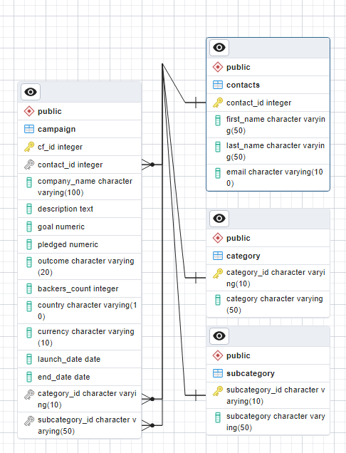

<h1 align="center">Crowdfunding ETL  </h1>

A collaborative project to build an ETL pipeline using Python, Pandas, and PostgreSQL for extracting, transforming, and loading crowdfunding data from Excel files into a relational database.

   ETL (Extract, Transform and Load) data processing is an automated procedure that extracts relevant information from raw data, converts it into a format that fulfills business requirements and loads it into a target system.

## Instructions
The instructions for this mini project are divided into the following subsections:

1. Create the Category and Subcategory DataFrames
2. Create the Campaign DataFrame
3. Create the Contacts DataFrame
4. Create the Crowdfunding Database

## Features
- Utilize Python and Pandas in order to:
   - Extract and transform crowdfunding and contact data from Excel files
   - Create and export Category, Subcategory, Campaign, and Contact DataFrames as CSV files
- Utilize PostgreSQL in order to: 
   - Design an ERD and table schema for the database
   - Create and populate PostgreSQL database tables

## Data

1. For our analysis, we have extracted and transformed data from the following datasets available in the `Resources` folder.      
     - contacts.xlsx      
     - crowdfunding.xlsx 

2. Then, we loaded our transformed data into `crowdfunding_db` PostgreSQL database.
     - category.csv  
     - subcategory.csv  
     - contacts.csv   
     - campaign.csv  

## Files included in Repository
- ETL_Mini_Project_Starter_Code_Leena.ipynb
  This file contains the code to transform input xlsx files into output csv files.

- crowdfunding_db_schema.sql
  This file contains code to create database in postgres as per the ERD.

  

## Outcome

In this project, we have demonstrated the ETL pipeline utilizing Python, Pandas, and a combination of both Python dictionary and regular expression techniques for data extraction and transformation. We were able to successfully generate four CSV files, and use the data in these files to design an ERD as well as table schema, then loaded the data into PostgresSQL database from the CSV files via dataframes.

